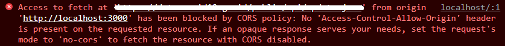

# Easily Deploy a CORS Proxy with AWS Amplify

## Motivation

As a web application developer, I often investigate how websites all over the internet turn their data API into their beautiful UI.
I look up their html elements and their network request, mostly _http requests_ to figure out their source code. 
As I mostly write React web apps, I will guess what's the states and effect, and the component librray the websites are using.

Sometimes, It also come across my mind to replicate it's UI. 
I look at their public data API and build a minimal reproduction environment using tools like codesandbox or spin up a small create-react-app project.
Unfortunately, this happened:



It often means [CORS](https://developer.mozilla.org/en-US/docs/Web/HTTP/CORS) is disabled, and due to the browser's [Same-origin policy](https://developer.mozilla.org/en-US/docs/Web/Security/Same-origin_policy), the browser refused to give the response data to the JavaScript. 
But then you asked yourself, the data is already public and tools like curl and postman can access it without the setback.

You may also come into this situation when working in a large team. 
The backend developers only work with the postman. 
They forget to set the response header `Access-Control-Allow-Origin : *` because it doesn't matter to them as their tests still pass without it.
You tell them to fix it, but it takes time and you have deadlines.

## About CORS Proxy

If you have experienced such agitations, CORS Proxy can be your savior.
Instead of sending a request directly to the data API server, the browser makes the request to a proxy server with CORS enabled.
During that request, the proxy server sent the actual request to the data API server.
This method will enable the browser to give JavaScript the data that it needs.
**No more CORS error!**

You actually don't have to spin up your own CORS Proxy as https://corsproxy.io/ is a thing. 
However, you are a developer and you don't want your service to be critically reliant on others, right?!
Then I might have a solution for your problem. 
It involves building your own CORS Proxy API with just a few commands.

## Prerequisites

The tech stack that we'll be using is [AWS Amplify Framework](https://aws.amazon.com/amplify/).
While it is a full stack framework, we'll only be using it for serverless backend development.
Supposed that you have completed its [getting started guide](https://docs.amplify.aws/start/q/integration/js/), you can skip this section and proceed to deploy.
Otherwise, start reading up the getting started guide and make sure that:

1. You have an AWS Account with IAM user with `AdministratorAccess-Amplify` role.
2. You have the latest [AWS Amplify CLI](https://github.com/aws-amplify/amplify-cli).


## Deploy

In this section, we will have a step-by-step deployment instruction. From your terminal:

1. Clone this repo to your local computer.

```sh
git clone https://github.com/artidata/amplify-cors-proxy.git
```

2. Go to the project directory.

```sh
cd amplify-cors-proxy
```

3. Initialize the amplify project. In this step, you have the option to decide which AWS account to deploy, which region, and whether it is a `dev` or `prod` environment

```sh
amplify init
```

4. Provision your serverless resources. In this step, you will deploy three resources to your aws account: one API Gateway, one AWS Lambda function, one Axios Lambda Layer.  

```sh
amplify push
```

Congratulations, now you have your own CORS Proxy. 
At the end of the push, it should be written in your terminal where the resource endpoint is located.
Start fetching from your websites to any data API that you want, regardless whether the data API enabled CORS or not. 

Note that provisioning these serverless resources shouldn't incur any charges.
Only when the the Lambda gets called, i.e your CORS Proxy is accessed, they will start charging you.
Read more about the pricing [here](https://aws.amazon.com/lambda/pricing/).

## Rollback and Issues

If you find yourself not satisfied with the provisioned resources, you can always delete it like any other AWS Amplify stack:

```sh
amplify delete
```

If you find any issues with the code, or you just want to give a feedback with the project, you can always start a new issue on this repo.

## Example

Supposed that you are here to check what the end product look like, or you want to have access to another free CORS Proxy. Here's one for you:

https://hngmsnp0y0.execute-api.ap-southeast-1.amazonaws.com/prod


## LICENSE

`amplify-cors-proxy` is licensed under the [ISC license](./LICENSE)